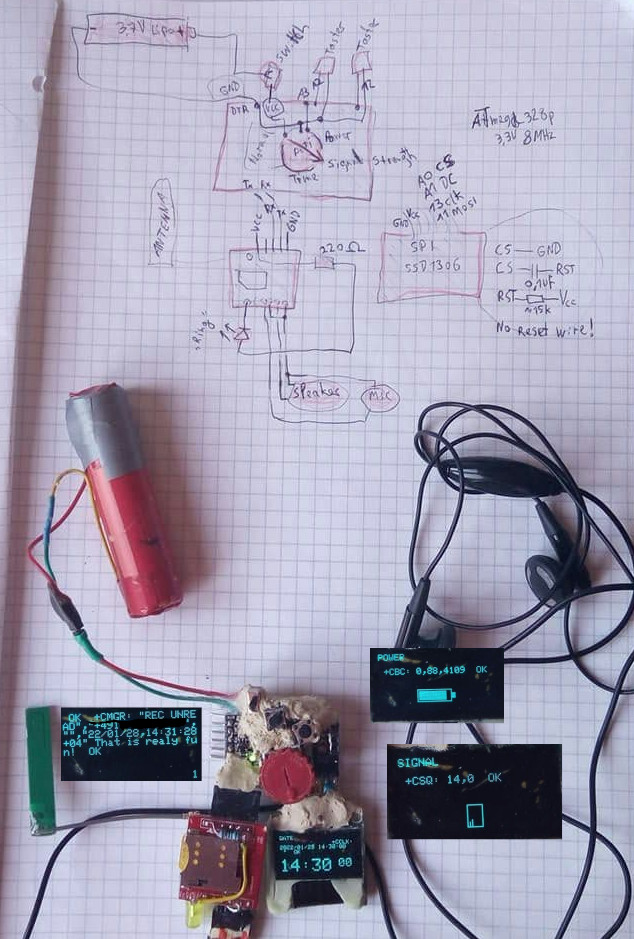

# ATMegaHandy

Improved phone with SIM800L GSM module, arduino pro mini, 2 buttons,
25k POTI and SD1306 SPI oled display.

It was a kick-ass code and a prove of concept to:

- take call / hang up
- read sms
- read date and time
- see signal strength
- see power of battery
- LED indicates incoming call

Usage:

- Poti switchs 6 modes
  - edit stored number 1-4, dail and send sms
  - normal
  - continoues date/time requests 
  - continoues signal strength requests
  - continoues battery power requests
  - audio recorder
- edit/dial/sms mode
  - poti: select nummber 1-4
  - button 1: select digit 1,2,3.... dial, send sms
  - button 2: change digit 0-9, space, + or select dial/hangup or send sms
- normal mode
  - button1
    - read sms 1,2,3,4,5,6, 1,2, ... (loop on press)
    - incoming sms stored incrementing on index 1,2,...
    - only the first 6 sms are accessable
    - press button2: delete all sms (index back to 1)
  - button2
    - on incomming call: accept
    - hang up (exit a call)
- date mode
  - button 1: NOT init network time sync
- signal strength mode
  - button 1: init gsm modem
  - button 2: gsm modem info
- power mode
  - button 1 and 2: select sms text for edit/dail/sms mode
- record mode
  - button 1: select function rec, play, pause, stop reord
  - button 2: execute function
  - automatic jump selection between:
    - rec, rec stop, play
    - play, pause

## Sketch

